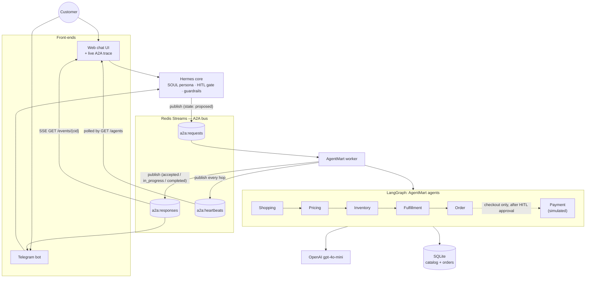

# MyShopper (Hermes) — an A2A buying agent for AgentMart

MyShopper is the customer-facing brand for **Hermes**, a personal buying agent that
never touches a product catalog directly. Instead, every shopping, pricing,
stock, delivery, order, or checkout question is handed off over **Agent-to-Agent
(A2A) messaging on Redis Streams** to **AgentMart**, a back-office ecosystem of
LangGraph agents that hold the real catalog and order book. A customer talks to
Hermes over a web chat (with a live, drill-down trace of every A2A hop) or over
Telegram; behind the scenes Hermes coordinates five LangGraph agents —
Shopping, Pricing, Inventory, Fulfillment, and Order — plus a sixth, Payment,
that only runs behind a human-in-the-loop (HITL) approval gate at checkout.

## Architecture



**Request lifecycle.** A message from Web or Telegram enters `HermesCore.start_request`,
which validates/sanitizes the text (`guardrails.validate_input`), assigns a
`correlation_id`, and publishes a `proposed` envelope onto `a2a:requests`. The
`agentmart_worker.py` consumer picks it up, immediately echoes an `accepted`
envelope onto `a2a:responses`, then classifies the intent and streams the
LangGraph run: as each agent (Shopping → Pricing → Inventory → Fulfillment →
Order, fanning out/joining as the intent requires) finishes its superstep, the
worker publishes that hop as its own `in_progress`/`completed` envelope — with
token usage and elapsed time attached — plus a heartbeat on `a2a:heartbeats`.
When the graph finishes, the worker publishes one terminal `completed` (or
`failed`) envelope, `sender: agentmart`, carrying the grounded customer reply.
Every envelope carries the same `correlation_id` so the whole exchange can be
reconstructed by replaying the stream (or `a2a_audit.jsonl`) in order. The web
UI's live trace is simply `GET /events/{cid}`, a Server-Sent-Events endpoint
that tails `a2a:responses` and forwards every envelope — hops included — to the
browser as it happens; Telegram drains the same generator on a worker thread.
A `checkout_payment` request pauses mid-flow: the worker publishes an
`input_required` envelope and blocks (via `await_confirmation`, polling
`a2a:requests`) until the customer's Approve/Decline arrives as a `confirm`/
`cancel` envelope on that same `correlation_id`, then either proceeds into the
Order + Payment agents or ends the run without ever touching payment.

## Submission requirements → where met

| # | Requirement | Where it's met |
| --- | --- | --- |
| 1 | Configure Hermes / MyShopper | `SOUL.md` (persona + AgentMart routing rule), loaded and applied by `hermes_core.py::HermesCore`; identity/capabilities in `hermes_a2a_config.json` |
| 2 | A2A connectivity over Redis Streams | `a2a_bus.py::A2ABus` wraps `XADD`/`XREAD` over three streams — `a2a:requests`, `a2a:responses`, `a2a:heartbeats` — used by `hermes_core.py`, `agentmart_worker.py`, and both front-ends |
| 3 | 5 LangGraph agents | `agentmart_ecosystem.py::build_graph()` — 5 core AgentMart agents (`shopping_agent`, `pricing_agent`, `inventory_agent`, `fulfillment_agent`, `order_agent`) routed by intent, plus a 6th (`payment_agent`) gated behind HITL for checkout; `hermes_myshopper_node` is the 7th, routing node |
| 4 | Token usage + elapsed time capture | `OpenRouterHermesClient.complete_with_metrics()` records `prompt_tokens`/`completion_tokens`/`total_tokens`/`elapsed_ms` per model call; carried on each hop's `metrics` and rendered live per-agent (and totalled) in `static/index.html`'s trace panel |
| 5 | Logging evidence | Structured `logging` in `agentmart_worker.py`, `hermes_web.py`, `hermes_telegram.py` (lifecycle events, cid, errors); a durable audit trail in `a2a_audit.jsonl` (one JSON line per published envelope, secrets redacted — `a2a_bus.py::_audit`); and the Redis streams themselves, inspectable live with `redis-cli XRANGE a2a:requests - +` etc. |
| 6 | OpenAI / OpenRouter model | `OpenRouterHermesClient` (OpenAI-SDK-compatible) — this deployment points it at **OpenAI directly, model `gpt-4o-mini`**, by setting `OPENAI_API_KEY`/`OPENAI_BASE_URL`/`OPENAI_MODEL` (the client also supports OpenRouter as a fallback path) |

**Extras beyond the base requirements:**

- **Web chat + live hierarchical trace** — `hermes_web.py` + `static/index.html`: every A2A envelope streams into the right-hand trace panel in real time, with per-agent token/timing badges and a click-to-expand drill-down of the raw envelope JSON.
- **Telegram front-end** — `hermes_telegram.py`, a second adapter over the same `HermesCore`, with inline Approve/Decline buttons for HITL.
- **HITL checkout gate** — `agentmart_worker.py::handle_request` pauses `checkout_payment` on a real payable order and waits for an explicit approval before any payment agent runs.
- **Guardrails** — `guardrails.py`: grounding strips any SKU-looking token the real catalog doesn't recognize, and input validation flags prompt-injection phrasing before it reaches the model.
- **Heartbeats / liveness** — `liveness.py` + `agentmart_worker.py::_publish_heartbeat`: every hop emits a heartbeat, and `GET /agents` reports each agent as `healthy` or `dead` against a TTL.

## Prerequisites

- Python 3.10+
- Docker (Desktop or Engine) with Compose v2, for the delivery path
- An OpenAI API key (for `gpt-4o-mini`)
- Optional: a Telegram bot token from [@BotFather](https://t.me/BotFather), if you want the Telegram front-end

## Run it

### Docker (delivery)

```bash
cp .env.example .env
# edit .env: set OPENAI_API_KEY, OPENAI_BASE_URL=https://api.openai.com/v1,
# OPENAI_MODEL=gpt-4o-mini, and (optionally) TELEGRAM_BOT_TOKEN

docker compose up --build
```

Open **http://localhost:8000** for the web chat + live trace. Redis, the
AgentMart worker, and the web front-end all start together; the first boot
seeds `data/agentmart.db` automatically (`entrypoint.sh`).

To also start the Telegram adapter (requires `TELEGRAM_BOT_TOKEN` in `.env`):

```bash
docker compose --profile telegram up --build
```

### Host dev

```bash
python -m venv .venv
# Windows
.\.venv\Scripts\Activate.ps1
# macOS/Linux
source .venv/bin/activate

pip install -r requirements.txt
python seed_data.py

# Redis on a non-default host port so it doesn't collide with a local Redis
docker run -d -p 6380:6379 --name myshopper-redis redis:7
```

Copy `.env.example` to `.env` and set `OPENAI_API_KEY`, `OPENAI_BASE_URL`,
`OPENAI_MODEL=gpt-4o-mini`, and `REDIS_PORT=6380` (host dev talks to Redis on
the host-mapped port; Docker Compose overrides this to the internal
`redis:6379` for you). Then, in separate terminals:

```bash
python agentmart_worker.py
python hermes_web.py
python hermes_telegram.py   # optional, needs TELEGRAM_BOT_TOKEN
```

**Shortcut:** `python dev_server.py` runs the worker **and** the web app together in
one process (serving http://localhost:8000), so you only need Redis plus, optionally,
`python hermes_telegram.py` for the Telegram channel. This is what the editor's
"dev server" preview launches.

Verify the model is reachable before a full run:

```bash
python agentmart_ecosystem.py --check-model
```

## Testing

```bash
pytest -v                 # 48 unit/integration tests (fakeredis-backed, no network)
python test_scenarios.py  # 9 end-to-end scenarios, dry-run by default; add --live to call the real model
```

`test_scenarios.py` covers the 5 intents across 7 named scenarios (including
two order-status edge cases and a chained buy-then-checkout run), plus an
intent-routing check over 14 phrasings and a chained scenario — 9 checks in
total. Beyond the automated suites, a live adversarial matrix — the 5 core
intents plus prompt-injection and off-topic probes (7 phrasings total) — was
run end-to-end against the real model to confirm `guardrails.py`'s grounding
and input-validation hold outside the dry-run harness.

## Guardrails

`guardrails.py` enforces two things on every request/response:

- **Grounding** (`ground_response`) — scans outgoing replies for anything
  SKU-shaped (`AM-XXX-XXXX`) that isn't in the real seeded catalog and replaces
  it with `[unverified SKU]`, so the model can never sell a product that
  doesn't exist. Real order ids and customer ids share the same surface shape
  and are explicitly preserved.
- **Prompt-injection / input validation** (`validate_input`) — strips control
  characters, caps input length, and flags phrases like "ignore previous
  instructions" or "reveal the system prompt" before the text reaches a model.

## HITL (human-in-the-loop)

A `checkout_payment` request never pays automatically. `agentmart_worker.py`
looks up a real payable order, publishes an `input_required` envelope with the
amount, and blocks on `await_confirmation` until the customer answers. The web
UI and Telegram bot both render this as an Approve/Decline choice; only an
explicit `confirm` resumes the graph into the Order and Payment agents. A
decline or a 120s timeout ends the run with no payment made.

## Heartbeats & liveness

Every agent hop the worker publishes also emits a heartbeat onto
`a2a:heartbeats` (`liveness.py` + `_publish_heartbeat`). `GET /agents` on the
web front-end replays unseen heartbeats into an in-memory `Liveness` tracker
and reports each known agent as `healthy` or `dead` once it's gone silent
longer than a TTL (default 6s) — surfaced as the status dots above the chat
panel.

## Repo layout

| File | Role |
| --- | --- |
| `a2a_bus.py` | Thin Redis Streams client (`XADD`/`XREAD`) plus the JSONL audit log |
| `agentmart_worker.py` | The A2A consumer: runs the LangGraph graph per request, streams hops, HITL checkout gate, heartbeats |
| `agentmart_ecosystem.py` | The LangGraph graph itself — state, agent nodes, intent routing, the OpenAI/OpenRouter model client |
| `hermes_core.py` | Shared client used by both front-ends: loads `SOUL.md`, validates input, publishes requests, streams responses, grounds replies |
| `hermes_web.py` | FastAPI app: chat UI, `/chat`, `/events/{cid}` (SSE trace), `/confirm`, `/agents` |
| `hermes_telegram.py` | Telegram adapter over the same `HermesCore`, with inline Approve/Decline for HITL |
| `guardrails.py` | Grounding (no invented SKUs) and prompt-injection/input validation |
| `liveness.py` | Pure last-seen/TTL tracker used for heartbeat-based dead-agent detection |
| `static/index.html` | The chat + live A2A trace single-page UI |
| `seed_data.py` | Seeds `data/agentmart.db` (SQLite) from `data/products.json` / `data/orders.json` |
| `catalog.py` | Read-side helpers over the seeded product catalog |
| `orders.py` | Read/write helpers over customers, orders, and simulated payments |

## Payments are simulated

`orders.py` generates `sim_`-prefixed payment references and writes them to
the local SQLite database. **No real payment processor is ever contacted, no
card data is stored, and no money moves** — this is a workshop/demo checkout
flow only.
